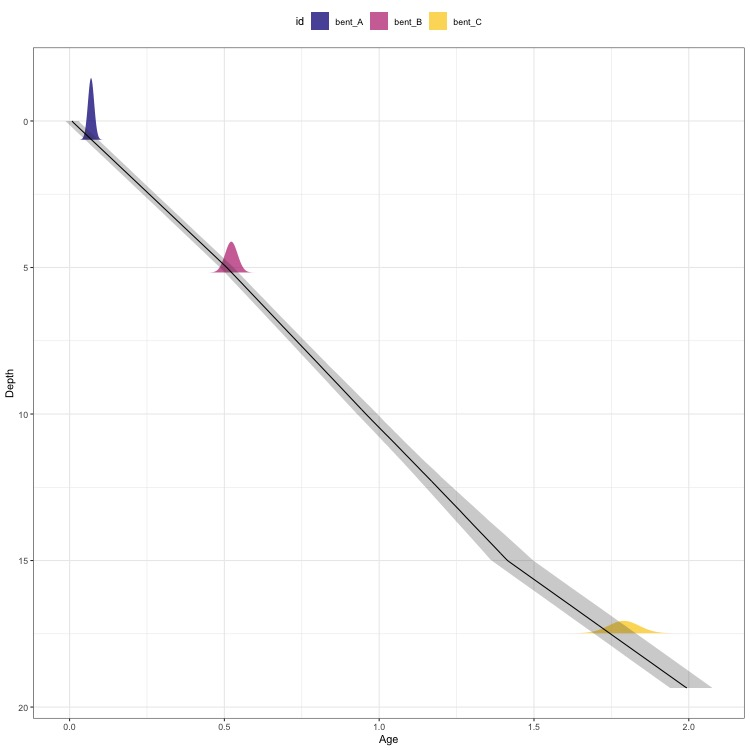
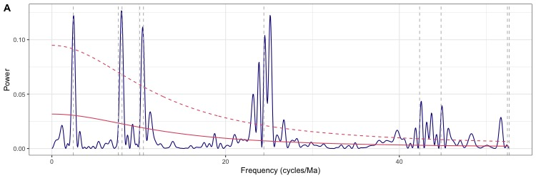

# astroBayes

`astroBayes` is a Bayesian framework for combining radioisotopic dates and cyclostratigraphic data into age-depth models. The background of the modeling framework and details of model construction are covered in: 

**Trayler, R. B., Meyers, S. R., Sageman, B. B., Schmitz, M. D., (in prep) *Bayesian Integration of Astrochronology and Radioisotope Geochronology***. 

A draft version of this manuscript is available at [github.com/robintrayler/astroBayes_manuscript](https://github.com/robintrayler/astroBayes_manuscript). 

## Installation

`astroBayes` is as an `R` package. It can be installed using the [`devtools`](https://github.com/r-lib/devtools) R package. 

```r
devtools::install_github('robintrayler/astroBayes')
```

## Using `astroBayes`

`astroBayes` is designed to fit age-depth models to paired radioisotope geochronology and cyclostratigraphic data. `astroBayes` *is not designed* to test for the presence of astronomical signals in data, instead it is intended to be used in conjunction with the testing methods available elsewhere, such as those available in [`{astrochron}`](https://geoscience.wisc.edu/research/x-ray-fluorescence-xrf-scanner-lab/astrochron-a-computational-tool-for-astrochronology/). 

### Running the `astroBayes` model

First, load `astroBayes`. 

```
library(astroBayes)
```

`astroBayes` includes a simple testing data set consisting of a set of radioisotopic dates, a cyclostratigraphic record, a set of target frequencies, and a set of layer boundaries. The example data can be loaded using the `data()` function. **For details on the mechanics of the `astroBayes` model and how `layer_boundaries` are selected see the manuscript linked above.** 

```
data("target_frequencies")
data("radioisotopic_dates")
data("cyclostratigraphic_data")
data("layer_boundaries")
```

The primary function in `astroBayes` is `astro_bayes_model()`. This function uses a Metropolis-Hastings Markov Chain Monte Carlo algorithm to fit an age-depth model to the data by finding the most probable sedimentation rate for each model layer.

Running the model will take a few minutes to several hours depending on the number of `iterations` and the complexity of the data (number of `dates`, number of data points in the cyclostratigraphic data, and the number of layers). A progress bar should pop up in the `R` terminal with a rough estimate of time remaining. The model below takes about 25 minutes to run on a 2022 MacBook Pro with an M1 Pro processor and 32 Gb of ram.

```
age_model <- astro_bayes_model(geochron_data = dates,
                               cyclostrat_data = cyclostrat,
                               target_frequency = target_frequencies,
                               layer_boundaries = layer_boundaries,
                               iterations = 10000,
                               burn = 1000)
```

### Plotting 
After the model has finished running you can visualize the results using several built in plots. 

The `age_depth` plot shows the age-depth model as a median (black line) and 95% credible interval (shaded grey region). The dates are shown as colored normal distribution.

```
plot(age_model, type = 'age_depth')
```


You can inspect the posterior distribution of sedimentation rate, either as  kernel density estimates or as trace plots. 

```
plot(age_model, type = 'sed_rate')
```


```
plot(age_model, type = 'trace')
```


You can also check for quality of the model fit by comparing a periodogram of the data with the age model applied. The target frequencies uses are shown as vertical dashed lines. 

```
plot(age_model, type = 'periodogram')
```


### Predictions

`astroBayes` can predict the age of stratigraphic points within the bounds of the age-depth model. Predictions us the `predict()` function. Positions to predict should be stored in a data frame with three columns: `position`, `thickness`, and `id`. 

```
# define some positions to predict 
new_positions <- data.frame(position = c(5, 10, 15), 
                            thickness = c(1, 0, 1), 
                            id = c('x', 'y', 'z'))
# predict the age                            
predictions <- predict(age_model, new_positions)
```

The output of `predict(age_model, new_positions)` is a `list()` with two entries. `$CI` contains the credible interval for each row in `new_positions`. `$posterior` contains the posterior sample of age for each row in `new_positions`. 

You can plot the predictions using `plot()`. 

```
plot(predictions)
```


### Summarizing

There are several summary types available in `astroBayes`. Each returns the 95% credible interval of the relevant model parameters. 

```
summary(age_model, type = 'sed_rate')
summary(age_model, type = 'dates')
summary(age_model, type = 'hiatus')
summary(age_model, type = 'anchor')
```


